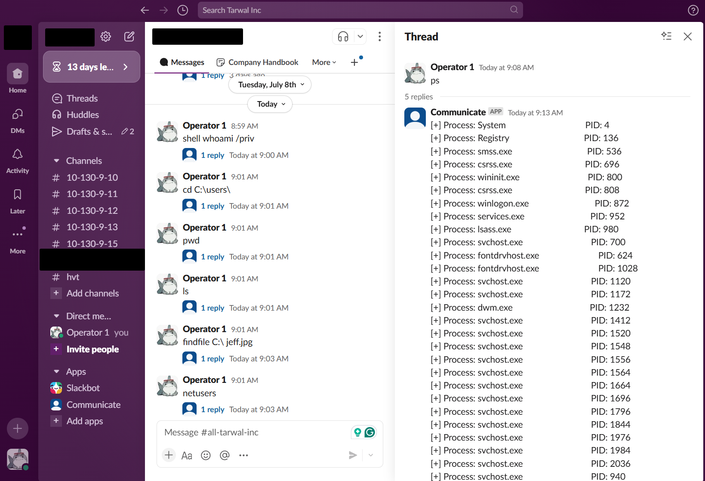

# Why Slack C2
This project was designed to be a proof of concept/training ground for me to test the things I was learning in SEC670, MalDev academy, and others. 




# Lessons Learned

- Using a 3rd party platform for C2 can impose certain limitations
	
	- If you might not be able to upload/download files as easily if your 3rd party platform (Slack, Google Drive, etc) scans the files and prevents their upload based on their determination of the file. You already might have to fight running SharpUp on the target, but now you need to fight with the site hosting your files too.
	   
	- You might only be able to do X requests in a minute. Is that a problem? Maybe, maybe not. Do you have more than one implant? Then yea, probably need to implement a backoff function of some kind to throttle the requests.

- Global variables are super convenient, but you should try not using them. These are generally not thread safe, and concurrent read/writes might prove problematic

- Memory management in C can be hard. Previously, I only ever wrote shellcode loaders. That's pretty easy, since you generally know before hand the fixed size you need to allocate. But what happens when you need to obtain the command from your C2. Is the command "ls", or "ThisIsSomeReallyLongArbitraryCommandToProveAPoint"? Your implant sure doesn't know, and will need to dynamically allocate enough size to hold the command you're wanting to parse and execute. What about having a buffer that stores the result of the command? Is it a single line of text, "WALMART/sam.altman"? Or do you need to append to a buffer for each line of output while you're iterating through a process list? Again, your implant wont know, and will need to be prepared to dynamically allocate memory and also resize a larger buffer as needed. Once I made custom functions that could overwrite an existing buffer, or append to one, I started getting WAY less access violation bugs, and eventually stopped encountering them altogether. I would recommend anybody writing in pure C to make their own wrapper functions that safely (Or at least in a function that can be easily patches) to help with their memory management, especially for functions like VirtualAlloc().
  
- Make sure you design your implant with kill switches, or with an exit function. I made the mistake of running some implants that I couldn't kill because I was only developing in the context of having a single implant. That brings me to my next point:

- Design the implant with multiple being able to run at the same time. Originally, I designed an implant to parse the last X messages from a slack channel, ignore the ones with replies, and reply to each message in a thread with the results from executed command. This was great for a single implant per channel. I did not think about this when I was having X implants running at the same time fighting to respond first to a message as a "first come first serve" style of operation. Eventually I had to make a new channel for each implant I compiled per host/user context.

- As a general programming philosophy, write smaller functions that do simple things instead of large functions that do lots of things. I wrote each command function (ps, upload, shell, username, etc) that it would take in a struct that held  ~5 elements. I only was accessing 2 in most all of them, and it was unnecessary to parse out these values from a struct rather than accept only the parameters I wanted. 
```c
/*
This at the time seemed easier and more clean. After all, I'm only passing one variable! How neat! However, I'd consider this to be a pretty bad practice that negatively effects the readability of the code. I can't really infer what the function is doing from the parameters, and I can't tell what members of the slackCmd variable are important.
*/
ps(SlackCmd* slackCmd) {
  
  // Parse the value we want
  slackCmd->buffer
  slackCmd->bufferSize
  
  // Do things

}

/*
This second version of the code allows me to reuse this function in other programs. If I were to try and use the function above in a new function, I'd have to untangle the Slack-specific programming logic out of it.
*/
ps(char* buffer, DWORD* bufferSize) {
  
  // Do things

}

```

- Using AI was most helpful with writing functions that would have taken me way too long to write, and that I felt were not worth the time investment. For example, parsing JSON in C. I began to use cJSON library which helped a lot, but ChatGPT did a pretty good job of writing a custom JSON parser for me in C without the need to reference that external code.

# Where do we go from here?
